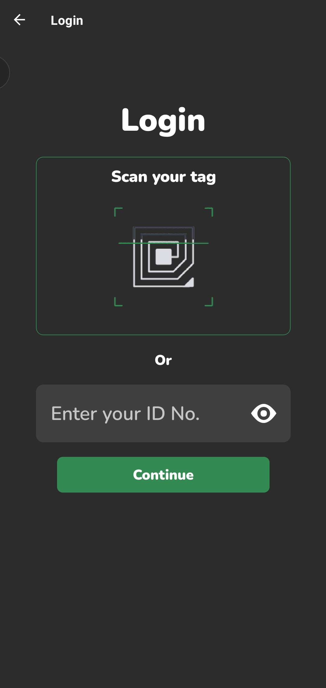
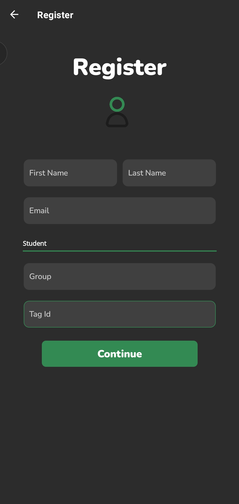
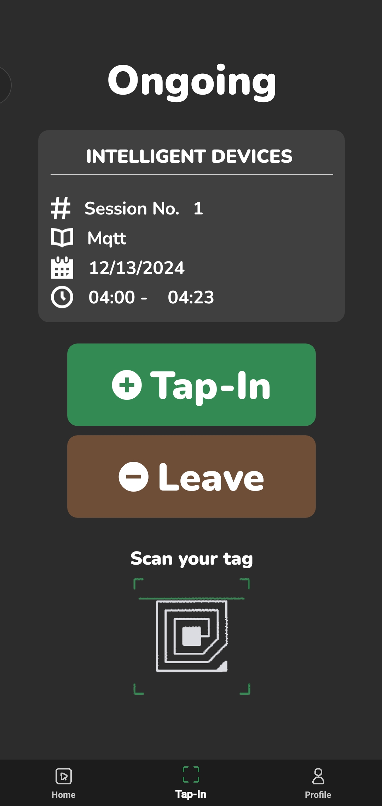
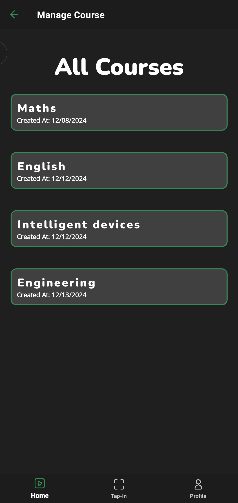
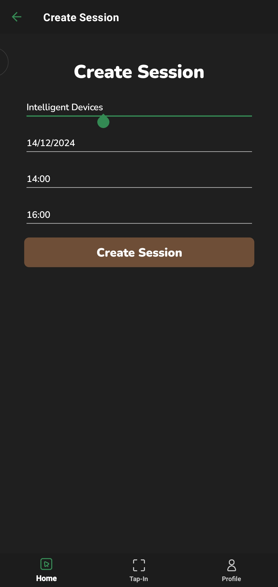

# StuAttendanceApp(TapIn) 
TapIn is a Student Attendance mobile application designed for educators who need an efficient way to manage and track student attendance. Built with .NET MAUI, the application utilizes RFID tags for access, allowing students to tap their RFID-enabled cards to register their attendance efficiently.
## Screenshots

